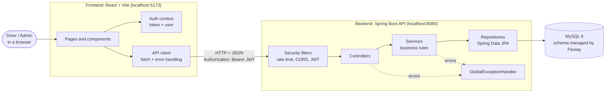
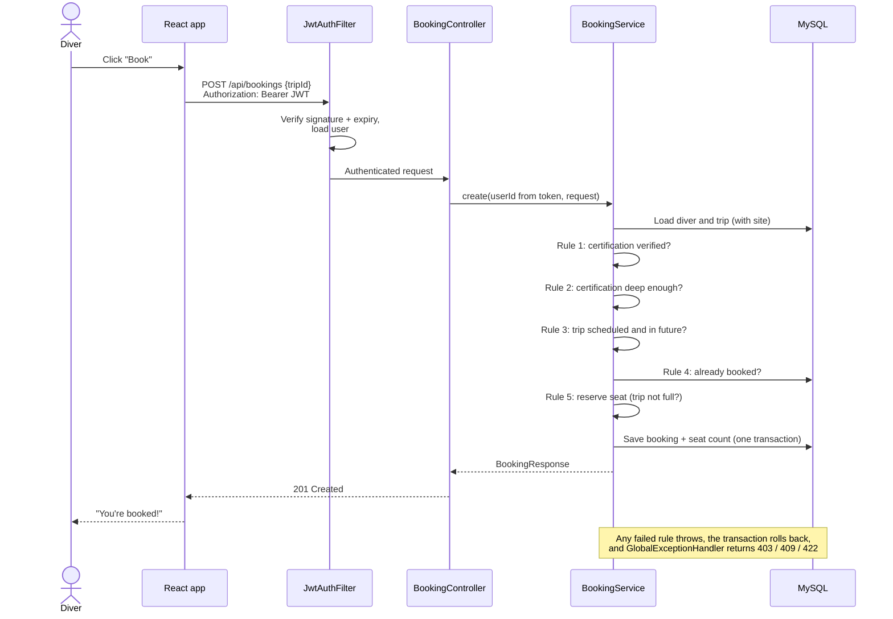
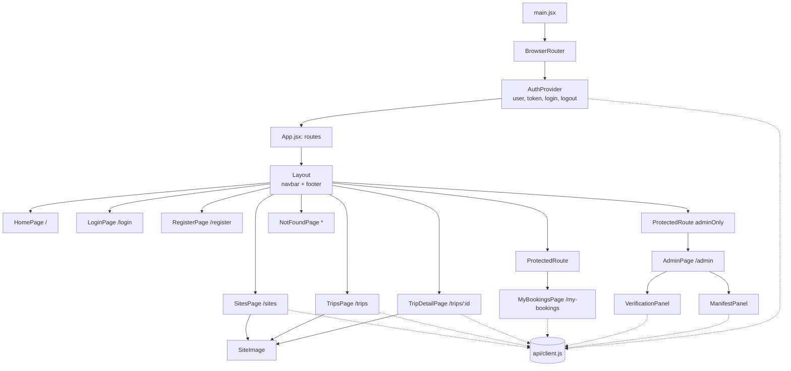

# DiveMatrix: Architecture

## System overview

DiveMatrix has three parts: a React single-page app, a Spring Boot REST API, and a MySQL database. The browser only ever talks to the API; the API is the only thing that talks to the database.

## Backend layers

| Layer | Package | Responsibility |
|---|---|---|
| Security | `security`, `config` | Rate-limit login/register, enforce CORS, verify JWTs, apply role rules |
| Controller | `controllers` | Map HTTP requests to service calls; validate input with `@Valid` |
| Service | `services` | Business rules (the 5 booking rules, cancellation, verification) inside `@Transactional` methods |
| Repository | `repositories` | Database queries via Spring Data JPA, including custom JPQL with `JOIN FETCH` |
| Model | `models` | JPA entities mapped to tables |
| DTO | `dto` | JSON shapes in and out, grouped by feature; entities are never exposed |
| Errors | `exceptions` | Custom exceptions and one handler that returns a consistent JSON error |

## Request flow: booking a trip

## Frontend component diagram

Every page that needs data calls the backend through `api/client.js`, which adds the JWT, turns error responses into readable messages, and logs the user out if a token has expired. `ProtectedRoute` hides pages for usability; the backend enforces access on every request.

## Key design decisions

| Decision | Reason |
|---|---|
| Stateless JWT instead of server sessions | Each request proves who it is, so the server stores no session state |
| CSRF protection disabled | Tokens travel in a header, not cookies, so CSRF does not apply (reviewed in SonarQube) |
| DTOs instead of returning entities | Controls the API's JSON exactly and never exposes fields like password hashes |
| Optimistic locking (`@Version`) on trips | Two people booking the last seat at once cannot both succeed |
| Flyway migrations | The database schema is versioned with the code and reproducible on any machine |
| Business rules in the service layer | Rules live in one place and are unit tested without a database |
