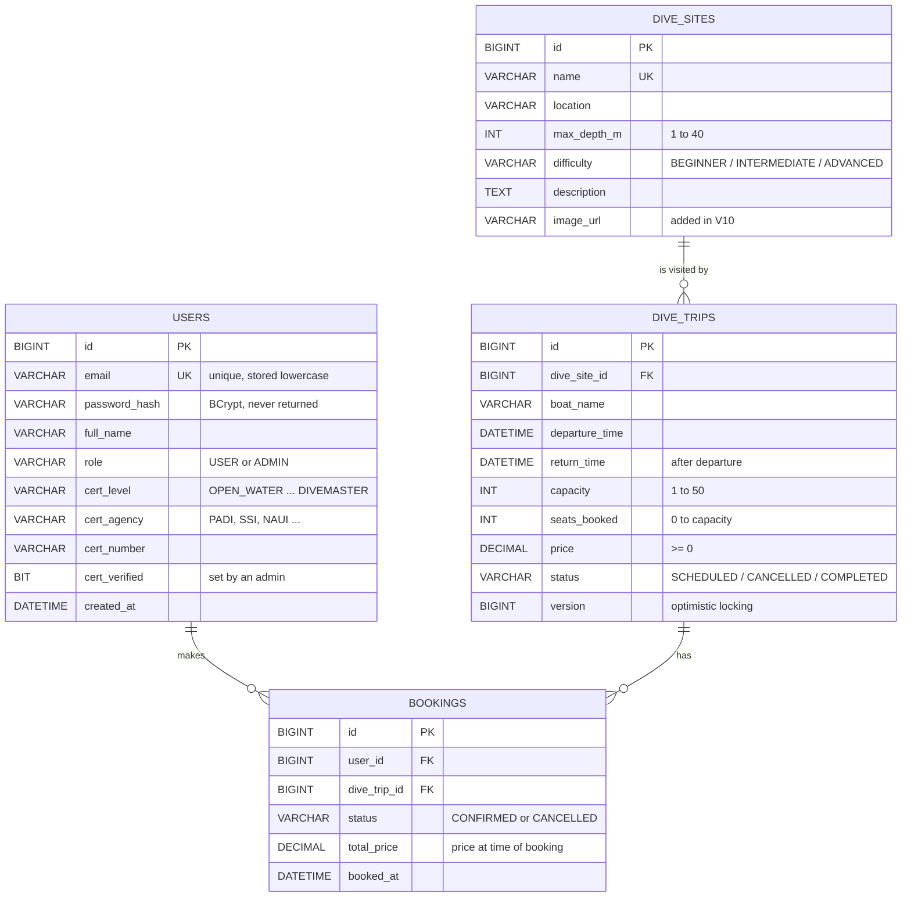

# DiveMatrix: Database Design (ERD)

The database is MySQL 8. Every table is created by Flyway migrations in `backend/src/main/resources/db/migration`, so the schema is versioned with the code and rebuilds identically on any machine.

## Entity relationship diagram

## Relationships

| Relationship | Type | Meaning |
|---|---|---|
| `dive_sites` → `dive_trips` | One to many | A site can have many trips; each trip goes to exactly one site |
| `dive_trips` → `bookings` | One to many | A trip has many bookings (up to its capacity) |
| `users` → `bookings` | One to many | A diver can have many bookings |
| `users` ↔ `dive_trips` | Many to many, through `bookings` | `bookings` is the join table, with its own data (status, price, date) |

## Constraints that protect the data

| Constraint | Table | Why |
|---|---|---|
| `UNIQUE (email)` | users | One account per email |
| `CHECK role IN ('USER','ADMIN')` | users | Only valid roles can be stored |
| `UNIQUE (name)` | dive_sites | No duplicate sites |
| `CHECK max_depth_m BETWEEN 1 AND 40` | dive_sites | 40 m is the recreational diving limit |
| `CHECK capacity BETWEEN 1 AND 50` | dive_trips | Realistic boat sizes |
| `CHECK seats_booked BETWEEN 0 AND capacity` | dive_trips | The database itself refuses overbooking |
| `CHECK return_time > departure_time` | dive_trips | Trips can't end before they start |
| `CHECK price >= 0`, `total_price >= 0` | dive_trips, bookings | No negative prices |
| Foreign keys | dive_trips, bookings | A trip can't point to a missing site; a booking can't point to a missing diver or trip |

## Design notes

- **No UNIQUE on (user_id, dive_trip_id) in bookings.** A cancelled booking is kept for history, and the diver may book the same trip again. "Only one *confirmed* booking per trip" is enforced in `BookingService` instead (rule 4).
- **`version` column on dive_trips.** Hibernate increments it on every update. If two divers book the last seat at the same moment, the second save sees a changed version and fails, so the boat is never overbooked.
- **`total_price` is copied onto the booking.** If the trip's price changes later, the diver's booking still shows what they actually paid.
- **Indexes** on `dive_trips (status, departure_time)` and `bookings (user_id, dive_trip_id, status)` match the queries the app runs most: "upcoming scheduled trips" and "does this diver already have a booking here?"
- **Enums are stored as text** (`VARCHAR`) rather than numbers, so the data is readable in Workbench and adding a new value can't silently shift existing rows.

## Migration history

| Version | What it does |
|---|---|
| V1 | Creates the tables, keys, constraints and indexes |
| V2–V8 | Seed data and schema adjustments made during development |
| V9 | Adds fresh upcoming trips for every dive site (demo data) |
| V10 | Adds `image_url` to dive_sites and sets a photo for each site |
